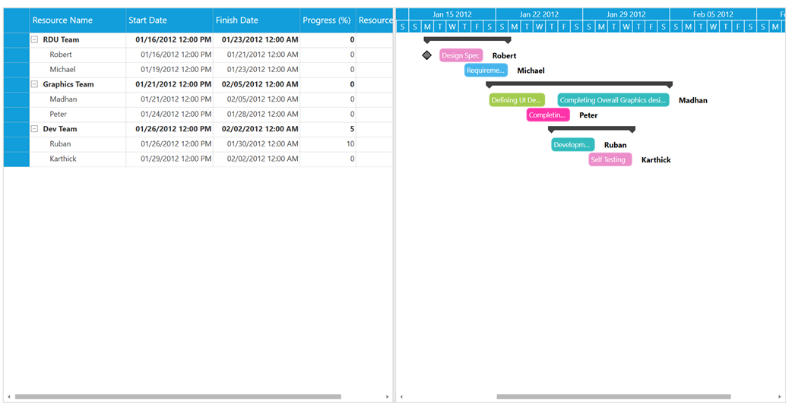

# How to display resource name in WPF Gantt chart

This article explains how to display the resource name in Syncfusion WPF Gantt chart as shown in below

 
 
It can be achieved by binding the required view model property in the ResourceInfoMapping property in TaskAttributeMapping as shown in below code snippet

**[XAML]**

```
  …
<Grid>

        <!--  Gantt Control information  -->
        <gantt:GanttControl x:Name="Gantt" Margin="10"
                                    ItemsSource="{Binding TeamDetails}"
                                    ShowDateWithTime="True" 
                                    ShowNonWorkingHoursBackground="False"
                                    ShowChartLines="False"
                                    ToolTipTemplate="{StaticResource toolTipTemplate}"
                                    VisualStyle="Metro">
            <i:Interaction.Behaviors>
                <local:GridCustomizationBehavior />
            </i:Interaction.Behaviors>
            <gantt:GanttControl.TaskAttributeMapping>
                <gantt:TaskAttributeMapping TaskNameMapping="Name"
                                                    StartDateMapping="StartDate"
                                                    ChildMapping="SubItems"
                                                    FinishDateMapping="FinishDate"
                                                    ProgressMapping="Progress"
                                                    ResourceInfoMapping="Resource"
                                                    InLineTaskMapping="InLineItems" />
            </gantt:GanttControl.TaskAttributeMapping>
            <gantt:GanttControl.Resources>
                <Style BasedOn="{StaticResource TaskNode}"
                               TargetType="gchart:GanttNode" />
                <Style BasedOn="{StaticResource HeaderNode}"
                               TargetType="gchart:HeaderNode" />
            </gantt:GanttControl.Resources>
        </gantt:GanttControl>
    </Grid>
                   …
```

**[C#]**

```
 public class ViewModel
    {
        /// <summary>
        /// private field for team details
        /// </summary>
        private ObservableCollection<Item> teamDetails;

        /// <summary>
        /// Initializes a new instance of the <see cref="ViewModel"/> class.
        /// </summary>
        public ViewModel()
        {
            this.teamDetails = this.GetTeamInfo();
        }

        /// <summary>
        /// Gets or sets the appointment item source.
        /// </summary>
        /// <value>The appointment item source.</value>
        public ObservableCollection<Item> TeamDetails
        {
            get
            {
                return this.teamDetails;
            }

            set
            {
                this.teamDetails = value;
            }
        }

        /// <summary>
        /// Gets the team info.
        /// </summary>
        /// <returns>returns the team info</returns>
        public ObservableCollection<Item> GetTeamInfo()
        {
            ObservableCollection<Item> teams = new ObservableCollection<Item>();

            teams.Add(new Item() { Name = "RDU Team" });
            Item Person = new Item() { Name = "Robert" };
            Person.InLineItems.Add(new Item() { StartDate = new DateTime(2012, 01, 16, 12, 0, 0), FinishDate = new DateTime(2012, 01, 16, 12, 0, 0), Name = "Design Spec" });
            Person.InLineItems.Add(new Item() { StartDate = new DateTime(2012, 01, 17, 12, 0, 0), FinishDate = new DateTime(2012, 01, 21), Name = "Design Spec" });
            teams[0].SubItems.Add(Person);

…
            Person = new Item() { Name = "Karthick" };
           Person.InLineItems.Add(new Item() { StartDate = new DateTime(2012, 01, 29, 12, 0, 0), FinishDate = new DateTime(2012, 02, 2), Name = "Self Testing" });
            teams[2].SubItems.Add(Person);


           //Adding resources to the last InLine Item.
            for (int i = 0; i < teams.Count; i++)
            {
                for (int j = 0; j < teams[i].SubItems.Count; j++)
                {
                    int count = teams[i].SubItems[j].InLineItems.Count;
                    string name = teams[i].SubItems[j].Name;
                    teams[i].SubItems[j].InLineItems[count - 1].Resource.Add(new Resource()
                    {
                        Name = name
                    });
                }
            }
            return teams;
        }
    }
                 …
```


## See also

[How to import and export the task details in Gantt](https://help.syncfusion.com/wpf/gantt/import-and-export-support)

[How to add custom tooltip to Gantt](https://github.com/SyncfusionExamples/how-to-refresh-wpf-gantt-schedule/blob/master)

[How to define your own schedule for Gantt to track the progress of projects](https://github.com/SyncfusionExamples/how-to-refresh-wpf-gantt-schedule/blob/master)

[How to differentiate the dates of holidays](https://github.com/SyncfusionExamples/how-to-refresh-wpf-gantt-schedule/blob/master)

